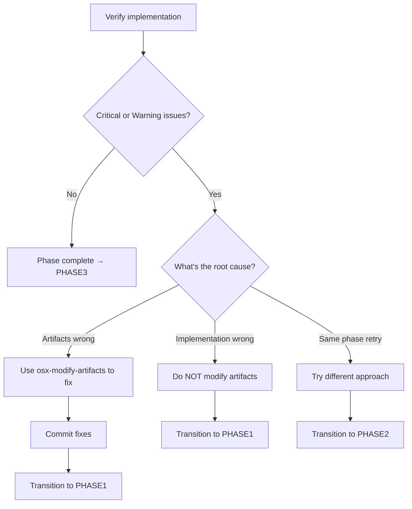

# OpenSpec Autonomous Workflow

Complete reference for the OpenSpec-extended autonomous orchestrator system.

**Purpose**: Guide AI agents working with the 7-phase autonomous implementation workflow.

**When to read this**: When executing `osx-phase0` through `osx-phase6` commands, when the orchestrator dispatches you, or when debugging orchestrator issues.

---

## Table of Contents

1. [System Overview](#1-system-overview)
2. [Agent Invocation Model](#2-agent-invocation-model)
3. [Tool Naming Convention](#3-tool-naming-convention)
4. [State Management](#4-state-management)
5. [Phase Reference](#5-phase-reference)
6. [Blocker Handling](#6-blocker-handling)
7. [Error Recovery](#7-error-recovery)
8. [Common Confusion Points](#8-common-confusion-points)

---

## 1. System Overview

### 1.1 What Is the Orchestrator?

The orchestrator is the Python engine in `source/orchestrator/engine.py`, exposed via the `openspec-extended orchestrate <change>` command (the entry point users run). The engine manages autonomous implementation of OpenSpec changes through 7 phases:

```
PHASE0: ARTIFACT_REVIEW  → osx-analyzer
PHASE1: IMPLEMENTATION   → osx-builder
PHASE2: REVIEW           → osx-analyzer
PHASE3: MAINTAIN_DOCS    → osx-maintainer
PHASE4: SYNC             → osx-maintainer
PHASE5: SELF_REFLECTION  → osx-analyzer
PHASE6: ARCHIVE          → osx-maintainer
```

> **PHASE2 name disambiguation**: the engine's canonical phase name is `REVIEW`. The skill it loads is `osc-verify-change` ("Verification"). Both refer to the same phase; you'll see `--phase REVIEW` in `decision-log.json` and the skill name as `osc-verify-change` in the phase command. See the main skill (§2) for the full cross-reference.

### 1.2 Orchestrator Loop

```mermaid
graph TB
    Start[Start] → LoadContext[Load state.json]
    LoadContext → InvokeAgent[Invoke agent with phase command]
    InvokeAgent → Execute[Agent executes phase]
    Execute → CheckComplete{Phase complete?}
    CheckComplete -->|No| NextIteration[Next iteration]
    CheckComplete -->|Yes| CheckBlocked{Blocked?}
    NextIteration → CheckBlocked
    CheckBlocked -->|Yes| Halt[Halt workflow]
    CheckBlocked -->|No| NextPhase[Advance to next phase]
    NextPhase → InvokeAgent
```

### 1.3 State Files

All state files live in `openspec/changes/<change-name>/`:

| File | Purpose | Lifecycle |
|-------|---------|------------|
| `state.json` | Current phase, iteration count, phase status | Updated each phase |
| `complete.json` | Blocker status (if workflow stopped) | Deleted before archive |
| `iterations.json` | History of all phase executions | Archived permanently |
| `decision-log.json` | Agent decisions and reasoning | Archived permanently |

After archive: Historical files move to `openspec/changes/archive/YYYY-MM-DD-<change>/`. Transient files (state.json, complete.json) deleted.

---

## 2. Agent Invocation Model

### 2.1 How Agents Are Invoked

The orchestrator spawns per-phase AI processes via OpenCode's `opencode run` command:

```bash
opencode run \
  --command "osx-phase0" \
  --agent "osx-analyzer" \
  "$CHANGE_ID" \
  --title="OpenSpec: $CHANGE_ID - ARTIFACT REVIEW" \
  --model="$MODEL"
```

The model defaults to the platform's configured default; override with `openspec-extended orchestrate --model <name>`.

**Key points**:
- `$CHANGE_ID` is passed as **positional argument** (not a flag)
- Phase commands reference it as `$1` in their markdown
- Agent receives full context including state files and history
- Each iteration is a **fresh subprocess**; per-subprocess timeout is `--timeout` (default 1800s)

### 2.2 Agent's Responsibilities

Each phase agent must:

1. **Load context**: Read `state.json` to understand current state
2. **Execute phase**: Follow instructions in phase command file
3. **Update state**: Call `osx state complete "$1"` when done
4. **Log decisions**: Use `osx log append "$1"` for traceability
5. **Signal blockers**: Call `osx complete set "$1" BLOCKED` if unrecoverable

### 2.3 Skill Loading

Phase commands instruct agents to "load and use" skills:

```
1. Load and use `osx-review-artifacts` skill for change "$1"
```

**What this means**:
- Read the skill file: `.opencode/skills/<skill-name>/SKILL.md`
- Follow the instructions in that skill
- The skill provides procedural knowledge for the specific task

**Example**:
```bash
# Agent reads this:
.opencode/skills/osx-review-artifacts/SKILL.md

# Then follows its instructions to review artifacts
```

---

## 3. Tool Naming Convention

### 3.1 The Three Tool Layers

| Prefix | Meaning | Source | Example |
|--------|----------|---------|---------|
| `osc-*` (renamed from `openspec-*`) | OpenSpec Core | Upstream npm package, renamed by installer | `osc-new-change` (was `openspec-new-change`), `osc-apply-change` (was `openspec-apply-change`) |
| `osx-*` | OpenSpec eXtended | Local extensions | `osx-review-artifacts`, `osx-modify-artifacts` |
| `openspec` | Core CLI | npm installed tool | `openspec status`, `openspec new change` |

### 3.2 When to Use Which Tool

| Situation | Tool | Skill / Command |
|-----------|-------|----------------|
| Start a change | `osc-new-change` skill | `openspec new change "$NAME"` |
| Create all artifacts | `osc-ff-change` skill | `openspec ff "$NAME"` |
| Implement tasks | `osc-apply-change` skill | Read skill file, follow instructions |
| Review artifacts | `osx-review-artifacts` skill | Read skill file, follow instructions |
| Modify artifacts | `osx-modify-artifacts` skill | Read skill file, follow instructions |
| Check status | `openspec` CLI | `openspec status --change "$1" --json` |
| Orchestration state | `osx` lib tool | `openspec-extended osx <domain> <action>` |

### 3.3 The `osx` Subcommand

Location: `openspec-extended osx` (CLI subcommand of the `openspec-extended` binary)

**Domains and Actions**:

| Domain | Action | Purpose |
|--------|--------|---------|
| `ctx` | `get` | Load aggregate context (state, history, config) |
| `state` | `complete` | Mark current phase as complete |
| `state` | `transition` | Explicit phase transition (PHASE2 uses this) |
| `state` | `set-phase` | Force-set phase (use `--from-phase` instead when possible) |
| `state` | `clear-transition` | Clear a pending transition |
| `phase` | `current` | Read current phase from state |
| `phase` | `next` | Read next phase in sequence |
| `phase` | `advance` | Force-advance to next phase (rare; use with care) |
| `log` | `append` | Record decision in decision-log.json |
| `iterations` | `append` | Record iteration in iterations.json |
| `complete` | `set BLOCKED` | Signal unrecoverable blocker |
| `baseline` | `record` / `get` | Starting commit snapshot |
| `validate` | `json` / `skills` / `commands` / `change-dir` / `archive` / `iterations` / `completion` | Pre-flight checks |

**Examples**:
```bash
# Load context
openspec-extended osx ctx get "$CHANGE_ID"

# Mark phase complete
openspec-extended osx state complete "$CHANGE_ID"

# Record decision
openspec-extended osx log append "$CHANGE_ID" \
  --phase IMPLEMENTATION \
  --summary "Completed authentication feature" \
  --extra '{"tasks_completed": ["1.1", "1.2"], "commits_made": 3}'

# Signal blocker
openspec-extended osx complete set "$CHANGE_ID" BLOCKED \
  --blocker-reason "Third-party API unavailable"
```

**Complete vocabulary** (every valid action per domain — canonical form):

| Domain | Read | Write / Mutate |
|--------|------|----------------|
| `ctx` | `get` | — |
| `git` | `get` | — |
| `baseline` | `get` | `record` |
| `state` | `get` | `complete`, `set-phase`, `transition`, `clear-transition` |
| `phase` | `current`, `next` | `advance` |
| `iterations` | `get` | `append` |
| `log` | `get` | `append` |
| `complete` | `check`, `get` | `set` |
| `validate` | `json`, `skills`, `commands`, `change-dir`, `archive`, `iterations`, `completion` | — |
| `instructions` | `instructions <artifact> [--change <name>] [--json]` | — |

The only canonical read verb is `get`. There is no `show` or `list` — use `get`. The only canonical write verbs are `append`, `complete`, `set-phase`, `transition`, `clear-transition`, `record`, `advance`, and `set` (for `complete`).

---

## 4. State Management

### 4.1 Phase Transitions

**Normal progression** (automatic):
- Agent calls: `osx state complete "$1"`
- Orchestrator advances to next phase
- No explicit transition command needed

**Explicit transitions** (used in PHASE2):
- Agent calls: `osx state transition "$1" <target> <reason> [details]`
- Orchestrator jumps to specified phase
- Used when implementation or artifacts need fixes

### 4.2 PHASE2 Transition Logic

PHASE2 (REVIEW) has complex decision logic:



**Transition commands**:

| Situation | Command | Reason Parameter |
|-----------|----------|-----------------|
| Artifacts are wrong | `osx state transition "$1" PHASE1 artifacts_modified` | "Fixed unclear specs in design.md" |
| Implementation is wrong | `osx state transition "$1" PHASE1 implementation_incorrect` | "Missing validation in API handler" |
| Same phase retry | `osx state transition "$1" PHASE2 retry_requested` | "Alternative verification strategy" |

**Critical**: Choose the correct case - wrong transition sends workflow to wrong place.

### 4.3 State File Structure

`state.json`:
```json
{
  "change_name": "add-user-auth",
  "current_phase": "PHASE2",
  "iteration": 3,
  "phases": {
    "PHASE0": { "status": "COMPLETE", "iterations": 2 },
    "PHASE1": { "status": "COMPLETE", "iterations": 4 },
    "PHASE2": { "status": "IN_PROGRESS", "iterations": 3 }
  },
  "history": {
    "iterations_recorded": 9,
    "last_phase": "PHASE1",
    "last_commit_hash": "abc123"
  }
}
```

`complete.json` (only created if BLOCKED):
```json
{
  "change_name": "add-user-auth",
  "status": "BLOCKED",
  "blocker_reason": "Third-party authentication API is down and cannot complete implementation",
  "blocked_at_phase": "PHASE1",
  "blocked_at_iteration": 2,
  "timestamp": "2025-03-16T10:30:00Z"
}
```

---

## 5. Phase Reference

### 5.1 PHASE0: Artifact Review

**Agent**: `osx-analyzer`
**Tool**: `osx-review-artifacts` skill

**Purpose**: Ensure artifacts are excellent before implementation

**Process**:
1. Load context: `osx ctx get "$1"`
2. Run review using `osx-review-artifacts` skill
3. If CRITICAL/WARNING issues found: **FIX IMMEDIATELY** with `osx-modify-artifacts`
4. If clean: Log and complete

**Critical**: Do not wait for next iteration to fix CRITICAL issues. Fix in same invocation.

**State update**:
```bash
openspec-extended osx state complete "$1"
```

### 5.2 PHASE1: Implementation

**Agent**: `osx-builder`
**Tool**: `osc-apply-change` skill + `osx-review-test-compliance` skill

**Purpose**: Implement tasks from `tasks.md`

**Process**:
1. Load context and read artifacts
2. Run `osc-apply-change` skill for implementation
3. **Milestone commits**: 1-5 commits per iteration (minimum 1)
4. Run `osx-review-test-compliance` after implementation
5. Fix test gaps until clean

**Milestone commit rules**:
- Subject: Imperative verb + brief (40-72 chars)
- Review staged: `git diff --staged` before commit
- NEVER bypass pre-commit hooks with `--no-verify`

**Deferred tasks**: AGENTS.md tasks deferred to PHASE3 (not PHASE1)

**State update**: `osx state complete "$1"`

### 5.3 PHASE2: Review

**Agent**: `osx-analyzer`
**Tool**: `osc-verify-change` skill

**Purpose**: Verify implementation matches artifacts

**Process**:
1. Load context
2. Run `osc-verify-change` skill
3. Analyze verification report
4. **Critical decision tree** (see Section 4.2)

**State updates**:
```bash
# Normal: all good
openspec-extended osx state complete "$1"

# Explicit transition: artifacts wrong
openspec-extended osx state transition "$1" PHASE1 artifacts_modified "Updated unclear specs"

# Explicit transition: implementation wrong
openspec-extended osx state transition "$1" PHASE1 implementation_incorrect "Missing validation"

# Explicit transition: retry
openspec-extended osx state transition "$1" PHASE2 retry_requested "Alternative strategy"
```

### 5.4 PHASE3: Maintain Documentation

**Agent**: `osx-maintainer`
**Tool**: `osx-maintain-ai-docs` skill

**Purpose**: Update AGENTS.md and CLAUDE.md after implementation

**Process**:
1. Load context
2. Read change artifacts
3. Read recent git history
4. Use `osx-maintain-ai-docs` skill
5. Update documentation following best practices
6. Commit changes

**Scope**:
- ✅ Root AGENTS.md
- ✅ Package-level AGENTS.md files
- ✅ CLAUDE.md (if applicable)
- ❌ Inline comments (done in PHASE1)
- ❌ README files (done in PHASE1)

**State update**: `osx state complete "$1"`

### 5.5 PHASE4: Sync

**Agent**: `osx-maintainer`
**Tool**: `osc-sync-specs` skill

**Purpose**: Merge delta specs into main specs

**Process**:
1. Load context
2. Use `osc-sync-specs` skill
3. Merge deltas from `changes/<name>/specs/` into `specs/`
4. Commit sync

**State update**: `osx state complete "$1"`

### 5.6 PHASE5: Self-Reflection

**Agent**: `osx-analyzer`
**Tool**: No specific skill (autonomous reasoning)

**Purpose**: Review workflow execution, identify improvements

**Process**:
1. Load full history from `iterations.json` and `decision-log.json`
2. Analyze what went well, what didn't
3. Create `reflections.md` with findings
4. Log insights for future improvements

**State update**: `osx state complete "$1"`

### 5.7 PHASE6: Archive

**Agent**: `osx-maintainer`
**Tool**: `osc-archive-change` or `osc-bulk-archive-change`

**Purpose**: Complete the change, archive historical files

**⚠️ CRITICAL**: All steps must complete in SINGLE invocation

**Process**:
1. Load context
2. **Delete transient files**: `state.json`, `complete.json`, `.openspec-baseline.json`
3. Execute archive: `osc-archive-change "$1"` or `osc-bulk-archive-change`
4. Update `decision-log.json` with completion summary
5. Update `iterations.json` with final entry
6. **Commit archive changes** in one commit
7. **Mark phase complete**: `osx state complete "$1"`

**Why atomic**: Partial execution triggers unnecessary re-execution. Archive is idempotent but expensive to re-run.

**State update**: `osx state complete "$1"`

---

## 6. Blocker Handling

### 6.1 What Is a Blocker?

A blocker is an **unrecoverable issue** that prevents workflow progress.

**Examples**:
- Third-party API permanently unavailable
- Critical dependency broken and cannot install
- External service down with no workaround
- Missing information that user cannot provide
- Fundamental design contradiction that cannot be resolved

**NOT a blocker** (fixable issues):
- Test failures that can be debugged
- Unclear specs that can be clarified
- Implementation bugs that can be fixed
- Missing dependencies that can be added

### 6.2 Signaling a Blocker

```bash
openspec-extended osx complete set "$CHANGE_ID" BLOCKED \
  --blocker-reason "Describe the specific blocking issue in detail"
```

**Good blocker reasons**:
```
"Third-party authentication API is returning 503 errors and support confirmed outage with no ETA"
"Required library 'crypto-sha256' is incompatible with Node.js 22 and no alternative available"
"Database migration script requires admin access which user does not have"
```

**Bad blocker reasons** (not blockers):
```
"Tests failing" → Fix in PHASE1
"Specs unclear" → Modify artifacts
"Need to refactor" → Continue implementation
```

### 6.3 What Happens After Blocking?

1. Orchestrator detects `BLOCKED` status in `complete.json`
2. Workflow halts immediately
3. Displays blocker reason to user
4. User must investigate and manually resolve

**Recovery options**:
- Fix blocker: Delete `complete.json`, resume with `--from-phase PHASEX`
- Start new change: If blocker can't be resolved

---

## 7. Error Recovery

### 7.1 Resume from Specific Phase

User can resume workflow from any phase:

```bash
openspec-extended orchestrate "$CHANGE_ID" --from-phase PHASE2
```

**Use cases**:
- Fix blocker in PHASE1, resume from PHASE2
- Skip exploration after starting change
- Debug failed phase by re-running it

### 7.2 Iteration Limits

Orchestrator enforces limits to prevent infinite loops:

| Setting | Default | Purpose |
|----------|-----------|---------|
| `--max-phase-iterations` | 10 | Maximum iterations per phase; `-1` = unlimited |
| `--timeout` | 1800 | Per agent subprocess timeout in seconds |

> **There is no `--max-total-iterations` flag.** Only `--max-phase-iterations`. If you've seen that flag mentioned elsewhere, it is stale documentation.

**When limit reached**:
- Orchestrator halts workflow
- Logs summary in `decision-log.json`
- User must investigate and intervene

### 7.3 Phase Failure Modes

| Failure Mode | Orchestrator Action | Agent Recovery |
|--------------|---------------------|----------------|
| Agent crashes | Retry up to 3 times | No action needed |
| Agent fails to mark phase complete | Wait for timeout | Run `osx state complete "$1"` manually |
| Invalid state transition | Log error, halt | Fix transition command, resume |
| Git commit fails | Log error, continue | Fix staged files, retry |

### 7.4 Logging for Debugging

Always log decisions with context:

```bash
openspec-extended osx log append "$1" \
  --phase IMPLEMENTATION \
  --iteration 3 \
  --summary "Completed authentication tasks 1.1-1.5" \
  --commit-hash "abc123" \
  --next-steps "Proceed to PHASE2" \
  --extra '{"tasks_completed": ["1.1", "1.2", "1.3", "1.4", "1.5"], "commits_made": 2}'
```

**Best practices**:
- Always include `commit-hash` when committing code
- Use `extra` JSON for structured data
- Be specific in `summary` (what, not why)
- Include `next-steps` for traceability

---

## 8. Common Confusion Points

### 8.1 Tool Name Confusion

**Wrong**: `osc ctx get "$1"`  
**Correct**: `osx ctx get "$1"`

**Explanation**: `osc-*` are OpenSpec core commands (from npm). `osx` is the extended lib tool for orchestration state.

**Check**: The invocation is `openspec-extended osx …` (CLI subcommand), not `osc-…` (core OpenSpec commands).

### 8.2 Skill Invocation Confusion

**Wrong**: Run a command to load skill  
**Correct**: Read skill file, follow instructions

**Explanation**: Skills are not executable commands. They're documentation files that agents read for guidance.

**Pattern**:
```
1. Load and use <skill-name> skill
   → Read: .opencode/skills/<skill-name>/SKILL.md
   → Follow instructions in that file
```

### 8.3 Transition Logic Mistakes

**Mistake**: Transition to PHASE1 when artifacts are correct but implementation is wrong

**Impact**: Workflow goes back to PHASE1, agent tries to fix artifacts (shouldn't)

**Correct**: Use `implementation_incorrect` reason, do NOT modify artifacts

**Mistake**: Transition to PHASE2 when artifacts need fixing

**Impact**: Workflow stays in PHASE2, verification fails again

**Correct**: Use `artifacts_modified` reason, go to PHASE1

### 8.4 PHASE6 Atomic Execution

**Mistake**: Stop after archiving files, before committing

**Impact**: Orchestrator re-runs PHASE6, archives again

**Correct**: Complete all steps in single invocation:
1. Delete transient files
2. Execute archive
3. Update decision-log.json
4. Update iterations.json
5. Commit changes
6. Mark phase complete

### 8.5 Blocker Misidentification

**Mistake**: Mark test failures as blockers

**Impact**: Workflow halts prematurely

**Correct**: Fix tests in PHASE1, continue

**Mistake**: Don't signal blocker when truly unrecoverable

**Impact**: Agent spins trying impossible task

**Correct**: Use `osx complete set "$1" BLOCKED` with clear reason

---

## Quick Reference

### Common Commands

```bash
# Load context
osx ctx get "$CHANGE_ID"

# Mark phase complete
osx state complete "$CHANGE_ID"

# Phase transition (PHASE2 only)
osx state transition "$CHANGE_ID" PHASE1 artifacts_modified "Fixed specs"

# Log decision
osx log append "$CHANGE_ID" --phase PHASE0 --iteration 1 --summary "Review complete"

# Signal blocker
osx complete set "$CHANGE_ID" BLOCKED --blocker-reason "API down"

# OpenSpec CLI
openspec status --change "$CHANGE_ID" --json
openspec instructions apply --change "$CHANGE_ID" --json
```

### Phase Summary

| Phase | Agent | Key Skills | Critical Requirement |
|--------|---------|-------------|---------------------|
| PHASE0 | osx-analyzer | review-artifacts, modify-artifacts | Fix CRITICAL issues immediately |
| PHASE1 | osx-builder | apply-change, review-test-compliance | Milestone commits (1-5 per iteration) |
| PHASE2 | osx-analyzer | verify-change | Correct transition logic |
| PHASE3 | osx-maintainer | maintain-ai-docs | Update AGENTS.md (not inline comments) |
| PHASE4 | osx-maintainer | sync-specs | Merge deltas into main specs |
| PHASE5 | osx-analyzer | None | Analyze workflow history |
| PHASE6 | osx-maintainer | archive-change, bulk-archive | **ATOMIC EXECUTION** - all steps in one call |
